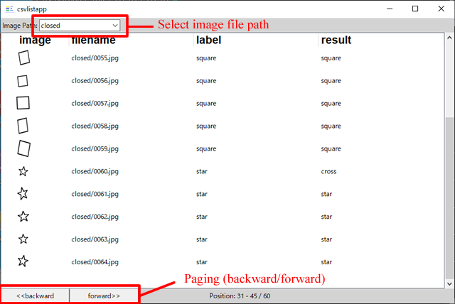

# CSV Image Viewer
This tool shows csv content which has one image-file-name and other texts in each line.

# Description
To use this tool, it requires image files and one csv file.
One line of csv file must have:
- Image file name (relative path is recommended)
- related info[1]	
- related info[2]	
	:	
And all line must have same number of columns.

Image file could be jpeg/png/bmp.. format which can be handled by PIL.Image.

Example of csv file is like:  
***  
> star/file00.jpg,star,star  
> wave/file01.jpg,wave,wave  
> circle/file02.jpg,circle,wave  
---

Possible operations for this tool are following:
- select image file path
- paging(forward/backward) in same file path.


# Usage

## launch viewer
```
$ python3 csvlistapp.py <csv-file> [options]
```

## options
--imagedir=directory-name  
```
	base directory of image files  
	if it was omitted, this tool uses current directory.  
```
--rows=number  
```
	number of rows to be displayed in one page.  
	if it was omited, this tool displays 10 rows on each page.  
```
--geometry=&lt;width&gt;x&lt;height&gt; 
```
	window size.  
	if it was omitted, 800x600 will be used.  
```
--height=number  
```
	row height in displayed list.  
	When image file is too large to display in list, this option shrinks image according to height.  
	if it was omitted, this tool displays with original image size.  
```
--columns=name1,name2,..  
```
	list of name for each column.  
```

# Demo

demo directory contains zip archive file to demonstrate.
After extracting zip archive at demo directory, <br>
type following at the top of this repository directory:

> $ python3 csvlistapp.py demo/sample.csv --imagedir=./demo --height=40 --rows=15 --columns=filename,label,result

# Requirements
python 3.5.6 and later (tested with 3.5.6/3.7.7(linux), 3.8.6(macosx), 3.10.11(windows)), built with tkinter.  
with Pillow 7.1.1 and later

# Note
when launching tool, python3 on macosx could warn about TK deprecation.
To suppress this, set environment variable described in warning message.

# Author
tailhome (tailhome@outlook.com)

# License
Please see LICENSE file.